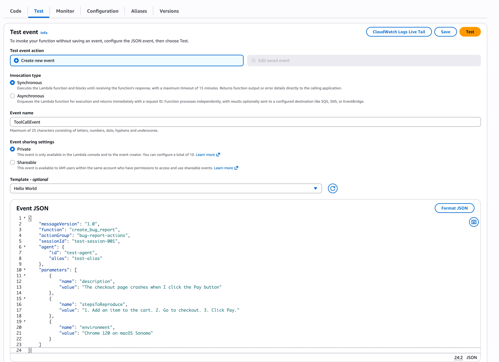
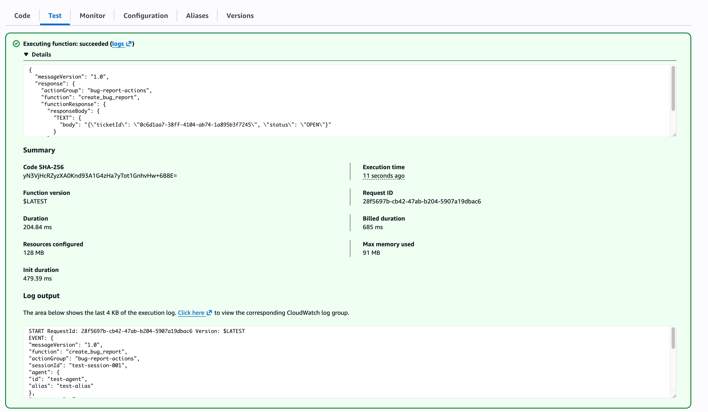
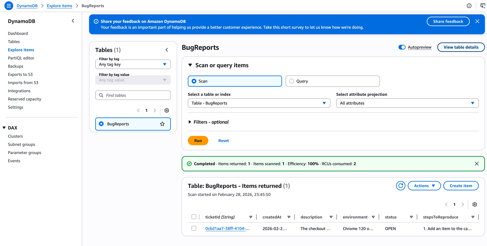
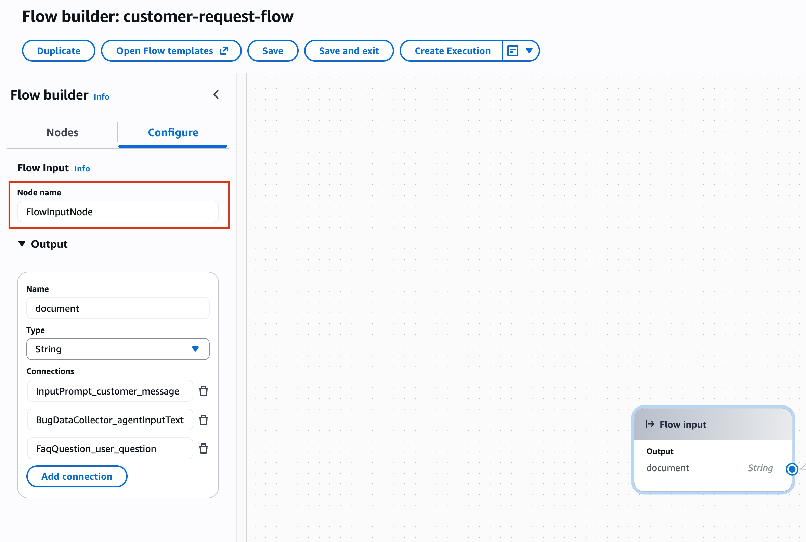
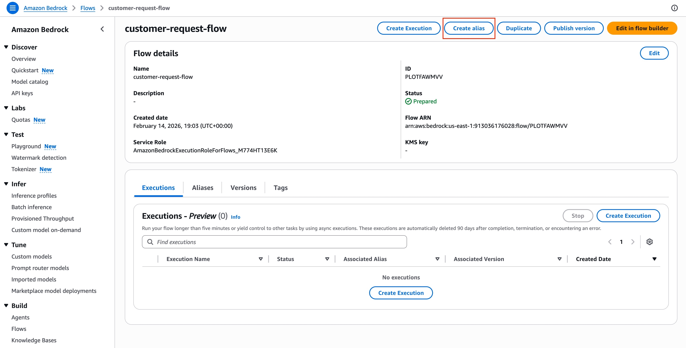
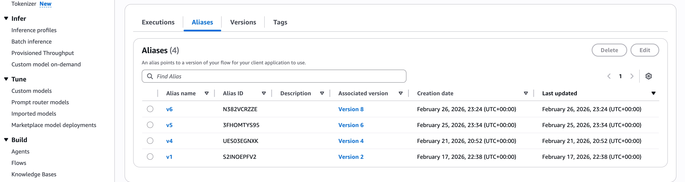
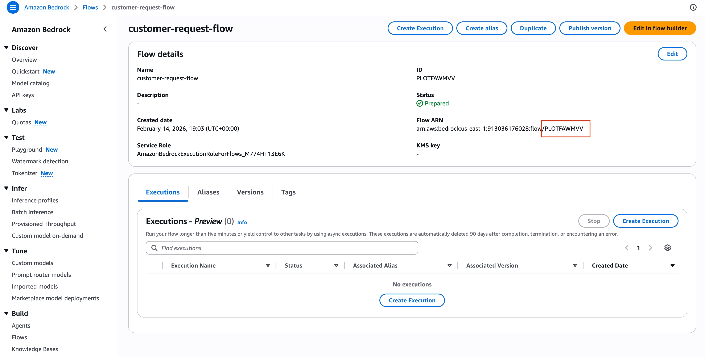
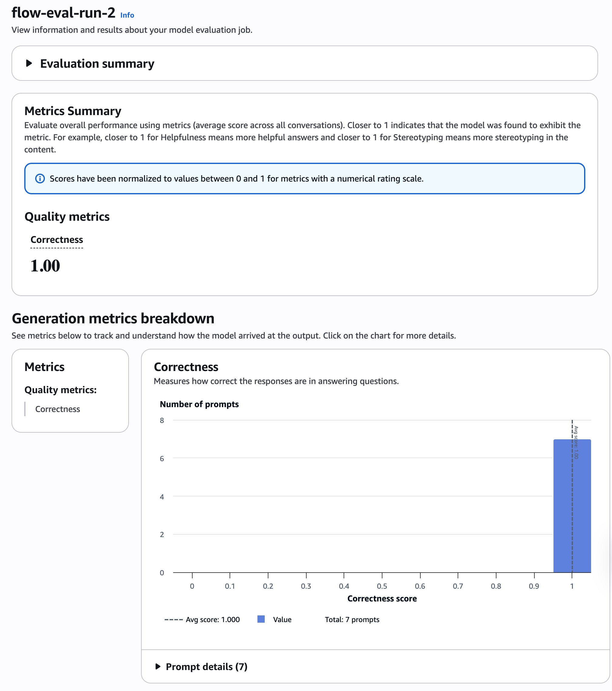

# Customer Support Chatbot with Amazon Bedrock AgentCore

## Contents

1. [Project Overview](#1-project-overview)
2. [Environment Setup](#2-environment-setup)
3. [Project Instructions](#3-project-instructions)
4. [Testing Framework](#4-testing-framework)
5. [Rubric](#5-rubric)

---

<div style="page-break-before: always;"></div>

# 1. Project Overview

> **PAGE 1 OF 5**

**Customer Support Chatbot with Amazon Bedrock AgentCore**

In this project you will build a customer support chatbot using the Amazon Bedrock AgentCore managed harness. The chatbot handles customers' messages for a fictional online shop and must route each message to the correct behavior based on its type:

- **Bug reports** — collect the details over the conversation, then file a ticket in a database using the `create_bug_report` tool.
- **Platform questions** — answer common questions about orders, shipping, returns, and payments using an embedded FAQ.
- **Other requests** — politely redirect the customer to a human support phone line.

> **KEY POINT — Why AgentCore?**  
> Bedrock Agents Classic was closed to new customers on July 30, 2026, so this course uses its successor, the AgentCore managed harness. Bedrock Evaluations — which you'll use for testing — is unaffected.

## How the Chatbot Should Behave

The centerpiece of this project is prompt engineering: all of the routing, information gathering, and grounding behavior lives in a single system prompt that you design. The harness supplies the agent loop — model calls, session memory, and tool execution — and your prompt supplies the behavior. There are no condition nodes or separate classifiers:

### Routing Logic

| Request type | Required behavior |
|---|---|
| **Bug report** | Collect the bug description, steps to reproduce, and environment. Once complete, call `create_bug_report` and return the ticket ID. |
| **Platform question** | Answer using only the FAQ embedded in the prompt. |
| **Other request** | Politely redirect the customer to a human support line. |

If the customer is reporting a bug, the chatbot collects the bug description, the steps to reproduce, and the customer's environment through conversation. Because harness sessions are stateful across turns, it can simply ask for whatever is missing. Once everything is collected, it files a ticket with the `create_bug_report` tool — a Lambda function exposed to the model through an AgentCore Gateway — and tells the customer their ticket ID.

If the customer has a question about the platform (orders, shipping, returns, payments), the chatbot answers using only the FAQ document embedded in the prompt.

If the request doesn't fit either category, the chatbot politely redirects the customer to a human support line.

> **YOUR TASK**  
> Write the system prompt that classifies each incoming message and produces the right behavior. How you describe the categories, structure the bug-report checklist, and phrase the routing rules is up to you.

## Available Resources

The project starter includes:

| File | Purpose |
|---|---|
| `system_prompt.txt` | Main deliverable: the system prompt for the chatbot |
| `cloudformation-tool.yaml` | Deploys the DynamoDB ticket table, the `create_bug_report` Lambda, and IAM roles for the gateway and harness |
| `create_bug_report.py` | Lambda function code that stores bug reports in DynamoDB |
| `setup_gateway.py` | Creates the AgentCore Gateway and registers the Lambda as the `create_bug_report` tool |
| `create_harness.py` | Creates or updates the managed harness from `system_prompt.txt` |
| `chat.py` | Terminal chat client for multi-turn testing |
| `online_shop_faq.md` | Fictional FAQ document for platform questions |
| `harness-tests-template.json` | Template for the test suite |
| `generate-eval-dataset.py` | Runs the harness against tests and produces a JSONL dataset for Bedrock Evaluations |
| `cloudformation-testing.yaml` | Deploys the S3 bucket and IAM role needed for evaluation |
| `cleanup_agentcore.py` | Deletes the harness, gateway target, and gateway |
| `requirements.txt` | Python dependencies |

## Technology Stack

- **Amazon Bedrock AgentCore managed harness** — runs the chatbot: agent loop, stateful sessions, and tool execution.
- **Amazon Bedrock AgentCore Gateway** — exposes the bug report Lambda as a tool.
- **Amazon Bedrock Evaluations** — LLM-as-a-judge evaluation.
- **AWS Lambda** — bug report tool runtime.
- **Amazon DynamoDB** — bug report storage.

## What You Will Demonstrate

- Prompt engineering for reliable message routing inside a single system prompt.
- Multi-turn information gathering using stateful harness sessions.
- Tool use through an AgentCore Gateway (Lambda + DynamoDB).
- Embedding reference documents in prompts for FAQ answering.
- Automated testing with Bedrock Evaluations using LLM-as-a-judge.

<div style="page-break-before: always;"></div>

# 2. Environment Setup

> **PAGE 2 OF 5**

## Getting Started

### Dependencies

Before starting the project, make sure you have the following:

- An AWS account with Amazon Bedrock and Amazon Bedrock AgentCore access enabled.
- AWS CLI configured with appropriate credentials.
- Python 3.9+ with boto3 1.43+ installed (`pip install -r requirements.txt`).
- Access to the Amazon Nova Pro model. This project pins `us.amazon.nova-pro-v1:0` everywhere — do not rely on the harness default model, which requires an AWS Marketplace subscription that lab accounts cannot complete.
- **Region: `us-east-1`** for all resources in this project.

> **IMPORTANT — REGION**  
> Make sure your AWS region is set to `us-east-1`. Every command, script, and template in this project assumes it. Some smaller regions may not have all Bedrock AgentCore features available.

> **COMPATIBILITY NOTE**  
> Bedrock Agents Classic was closed to new customers on July 30, 2026. This project runs on its successor, the Amazon Bedrock AgentCore managed harness, with the bug-report tool exposed through an AgentCore Gateway. Bedrock Evaluations is unaffected.

## Project Files

All of the files below live in `project/starter/` in the project repository. Run every command in this project from that folder.

| File | Description |
|---|---|
| `cloudformation-tool.yaml` | Creates the DynamoDB table, `create_bug_report` Lambda, and IAM roles for the gateway and harness |
| `cloudformation-testing.yaml` | Creates evaluation resources (S3 bucket + evaluation role) |
| `create_bug_report.py` | Lambda code that stores bug reports in DynamoDB |
| `setup_gateway.py` | Creates the AgentCore Gateway and registers the Lambda as the `create_bug_report` tool |
| `system_prompt.txt` | Main deliverable — the system prompt |
| `create_harness.py` | Creates or updates the managed harness from `system_prompt.txt`; re-run after prompt changes |
| `chat.py` | Terminal client for multi-turn chatbot testing |
| `online_shop_faq.md` | Fictional FAQ covering orders, shipping, returns, payments, products, account, and privacy |
| `harness-tests-template.json` | Template for developing the test suite |
| `generate-eval-dataset.py` | Runs the harness against a test suite and produces JSONL for Bedrock Evaluations |
| `cleanup_agentcore.py` | Deletes the harness, gateway target, and gateway |
| `requirements.txt` | Python dependencies (`boto3 1.43+`) |

### Step 1: Deploy the Tool Stack and Create the Gateway

When a customer reports a bug, the chatbot needs to persist it somewhere so the engineering team can follow up. This project uses a DynamoDB table as a simple ticket store and a Lambda function as the tool implementation. The chatbot reaches the Lambda through an AgentCore Gateway — the gateway presents the Lambda to the model as a callable tool named `create_bug_report`.

**1. Deploy the tool stack (DynamoDB table + Lambda + IAM roles):**

```bash
aws cloudformation deploy \
  --template-file cloudformation-tool.yaml \
  --stack-name bug-report-tool-stack \
  --capabilities CAPABILITY_NAMED_IAM \
  --region us-east-1
```

> **IAM NOTE**  
> The `--capabilities CAPABILITY_NAMED_IAM` flag is required because the template creates named IAM roles. The stack also creates a gateway role and a harness execution role.

**2. Create the gateway and register the tool:**

```bash
python setup_gateway.py
```

The script reads the stack outputs itself — no copy-pasting required — and saves everything the later steps need to `agentcore_config.json`.

> **TROUBLESHOOTING**  
> If `setup_gateway.py` fails right after the stack finishes with an access or validation error mentioning the role, that's likely IAM propagation delay. The script already retries; if it still fails, run it again a minute later.

You will create the harness itself with `create_harness.py` after writing your system prompt — see the Instructions page.

<div style="page-break-before: always;"></div>

# 3. Project Instructions

> **PAGE 3 OF 5**

## Step 1: Create Resources for Your Application

You already deployed the tool stack and created the gateway on the Environment Setup page. As there, every command on this page runs from `project/starter/` in the project repository.

Here is a recap of what `cloudformation-tool.yaml` created, and how to verify the tool works in isolation before you build your prompt around it.

| Resource | Name | Purpose |
|---|---|---|
| DynamoDB table | `bug-report-tool-stack-bug-reports` | Stores one item per bug report, keyed by `ticketId` |
| Lambda function | `bug-report-tool-stack-create-bug-report` | The `create_bug_report` tool implementation — writes tickets to DynamoDB |
| IAM role | `bug-report-tool-stack-lambda-role` | Grants the Lambda permission to write logs and call `PutItem` on the table |
| IAM role | `bug-report-tool-stack-gateway-role` | Assumed by the AgentCore Gateway to invoke the Lambda on the model's behalf |
| IAM role | `bug-report-tool-stack-harness-role` | Assumed by the managed harness to call Bedrock models and invoke the gateway |

Running `setup_gateway.py` registered the Lambda behind an AgentCore Gateway target named `bugreports`, so the model sees the tool as `bugreports___create_bug_report`.

## Test the Lambda Function

Before wiring the tool into your prompt, verify it works in isolation. In the Lambda console, open the `bug-report-tool-stack-create-bug-report` function and go to the **Test** tab.

The AgentCore Gateway sends the tool arguments directly as the Lambda event — a plain JSON object with no wrapper envelope. Create a new test event with the following JSON:

```json
{
  "description": "The checkout page crashes when I click the Pay button",
  "stepsToReproduce": "1. Add an item to the cart. 2. Go to checkout. 3. Click Pay.",
  "environment": "Chrome 120 on macOS Sonoma"
}
```



Click **Test**. You should see a successful response containing a `ticketId` and `"status": "OPEN"`.



To confirm the record was written, go to the DynamoDB console, open the `bug-report-tool-stack-bug-reports` table, and click **Explore table items**. You should see one item with the ticket ID from the response.



> **TROUBLESHOOTING**  
> If the test fails with `AccessDeniedException`, check that the IAM policy is attached to the correct execution role. If it fails with `ResourceNotFoundException`, verify that the Lambda's `TABLE_NAME` environment variable matches `bug-report-tool-stack-bug-reports`. The Lambda also prints every event it receives to CloudWatch Logs (`/aws/lambda/bug-report-tool-stack-create-bug-report`) — the ground truth for what actually reached it.

## Step 2: Build the Harness — Design the System Prompt

Now the fun part. Open `system_prompt.txt` and write the system prompt for your chatbot. Your application needs to handle three types of requests, and the routing between them is done entirely by your prompt — there are no condition nodes or classifiers, just instructions:

- **Bug reports** — collect additional information and create a ticket using the `create_bug_report` tool from Step 1.
- **Platform questions** — answer common questions about orders, shipping, returns, and payments using the FAQ.
- **Other requests** — politely redirect the customer to a human support phone line.

## Bug Report Tool Parameters

The `create_bug_report` tool accepts three parameters — **all of them required**:

| Parameter | Required | Description |
|---|---|---|
| `description` | Yes | Description of the bug, in the customer's words |
| `stepsToReproduce` | Yes | Steps to follow to reproduce the issue |
| `environment` | Yes | Customer's environment (browser, OS, device) |

> **GATE CONDITION**  
> Customers rarely provide all three up front. Because the harness keeps session state across turns, your chatbot can simply ask for what's missing. Make sure your prompt tells it to collect **all three fields before calling the tool**.

## Embed the FAQ

Platform questions (orders, shipping, returns, payments) need to be answered from the shop's FAQ. Here the document is embedded directly in the prompt — the model sees it at inference time and answers from it.

Keep the `{{FAQ}}` placeholder in `system_prompt.txt`; `create_harness.py` replaces it with the contents of `online_shop_faq.md` automatically.

> **DESIGN NOTE**  
> Embedding documents in the prompt works well for short, stable content like a FAQ. For large documents, embedding the full text in every prompt becomes expensive and hits context limits. The standard solution is Retrieval-Augmented Generation (RAG), which retrieves only the relevant passages at query time using a vector index. RAG with Amazon Bedrock Knowledge Bases is outside the scope of this course.

## Create the Harness and Iterate

When your prompt is ready, create the harness and chat with it:

```bash
python create_harness.py     # first run takes ~2-3 minutes
python chat.py               # each run = one fresh conversation
```

Iterating is fast: edit `system_prompt.txt`, re-run `create_harness.py` (it updates the existing harness), and start a new `chat.py` session. There is no **prepare** step and nothing to redeploy — the harness picks up prompt changes as soon as `create_harness.py` finishes.

## Tips

> **TIP 1 — ROUTING**  
> Treat routing as a classification problem inside your prompt: describe the three categories crisply and tell the model to pick exactly one before doing anything else. Vague category definitions produce vague routing.

> **TIP 2 — BUG CHECKLIST**  
> Be explicit about the bug-report checklist (`description`, `stepsToReproduce`, `environment`) and tell the model not to call the tool until every item is collected. Asking one question at a time works noticeably better than asking for everything at once.

> **TIP 3 — FAQ GROUNDING**  
> Tell the model to answer platform questions only from the FAQ, and what to do when the FAQ doesn't cover the question.

> **TIP 4 — TICKET ID**  
> When the tool succeeds it returns a `ticketId` — instruct the model to relay it to the customer, so you can find the ticket in DynamoDB later.

```bash
aws dynamodb scan --table-name bug-report-tool-stack-bug-reports --region us-east-1
```

The tool call appears in `chat.py` as a `[tool call] bugreports___create_bug_report` line — if you never see it, your prompt probably isn't telling the model clearly when to use the tool.

> **IMPLEMENTATION RULE**  
> Implement and test your solution step by step. Use the `us-east-1` region, as some smaller regions might not have all Bedrock AgentCore features.

## Step 3: Testing

Once your chatbot works, you can keep testing it manually with `chat.py`. However, manual testing is tedious and not scalable. For automated testing:

1. Create a set of test prompts and define expected results — copy `harness-tests-template.json` (for example, to `harness-tests.json`) and fill in your test cases, covering all three routes.
2. Run your application programmatically on the test set with `generate-eval-dataset.py`.
3. Use Bedrock Evaluations to evaluate your application's outputs.

> **NEXT**  
> Follow the detailed steps in the Testing Framework page to run automated tests and evaluate your chatbot.

## Submission Checklist

- **Routing** — The system prompt routes every customer message to exactly one of three behaviors: bug-report collection, FAQ answering, or a polite human hand-off.
- **Bug Report Handling** — Collect the bug description, steps to reproduce, and environment across the conversation before calling `create_bug_report`, then relay the ticket ID. A record is created in the DynamoDB table.
- **FAQ and Hand-Off Handling** — Platform questions are answered only from the FAQ embedded via `{{FAQ}}`, with a hand-off when the FAQ doesn't cover the question. Out-of-scope requests get a polite redirect to the human support phone line.
- **Testing and Evaluation** — `harness-tests.json` covers all three routes, `generate-eval-dataset.py` produces JSONL, a Bedrock Evaluations job is created, and you provide written observations.

## Stand-Out Suggestions

- Add edge-case test prompts: ambiguous messages, very short messages, and prompt injection attempts.
- Harden your system prompt against prompt injection (for example, instructions that attempt to survive "ignore your previous instructions").
- Add multi-turn bug-report tests and verify the ticket fields in DynamoDB match what the customer said.
- Extend the FAQ with your own entries and verify the chatbot picks up new answers after re-running `create_harness.py`.

<div style="page-break-before: always;"></div>

# 4. Testing Framework

> **PAGE 4 OF 5**

## Testing and Evaluation

Once your chatbot works end to end, you need to verify that it handles different messages correctly and produces expected responses. This guide walks you through the full testing workflow: writing test prompts, running the test script against your harness, and evaluating the results using Bedrock Evaluations.

Bedrock Evaluations can't run your harness directly, so instead you invoke the harness on each test prompt, store its responses in a JSONL file, and upload that file to Bedrock Evaluations.

> **FORMAT NOTE — JSONL**  
> JSONL is a file format where every line represents a separate JSON document. This is in contrast to a JSON file, where the whole file represents a single JSON document.

## Automated Testing and Evaluation

This project includes a script that runs your application on a set of prompts. To use it, you need to:

1. Create a list of test prompts in a separate file.
2. Run the testing script.
3. Evaluate the output using Bedrock Evaluations.

### 1. Write Test Prompts

Before you can run any automated tests, you need a set of test prompts that cover each route of your chatbot. The goal is to have at least one prompt per category — a bug report, a FAQ question, and an out-of-scope request — so you can verify that your system prompt routes messages to the correct behavior.

#### Steps

Copy `harness-tests-template.json` to a new file called `harness-tests.json`:

```bash
cp harness-tests-template.json harness-tests.json
```

Open `harness-tests.json` and add the prompts you want to test your application on. The template shows the structure:

```json
{
  "tests": [
    {
      "id": "<unique-test-id>",
      "prompt": "<customer-message>",
      "expected": "<description-of-expected-response>"
    }
  ]
}
```



Fill in the three fields for every test case:

| Field | Description |
|---|---|
| `id` | A unique identifier for the test (for example, `t1_bug_report`). Used in log output to identify which test is running. |
| `prompt` | The customer message to send to the harness. Write realistic messages that clearly belong to one category. |
| `expected` | A description of what a good response should contain. This becomes the reference response for LLM-as-a-judge evaluation; it does not need to be an exact match. |

> **IMPORTANT — SESSION ISOLATION**  
> Each test case runs as a single turn in a fresh session (a new `runtimeSessionId`), so tests cannot influence each other. For the bug-report route, the expected result should describe the start of collection behavior, not a finished ticket.

### 2. Set Up the Python Environment

The test script (`generate-eval-dataset.py`) uses boto3 to call the Bedrock AgentCore API. Before running it, set up a Python virtual environment and install the dependencies.

Every command on this page runs from `project/starter/` in the project repository.

**Create a virtual environment:**

```bash
python3 -m venv venv
```

**Activate it:**

```bash
source venv/bin/activate
```

**Install the dependencies:**

```bash
pip install -r requirements.txt
```

**Verify that boto3 is installed:**

```bash
python -c "import boto3; print(boto3.__version__)"
```

This should print `1.43.76` (or newer) without any errors — the Bedrock AgentCore APIs require boto3 1.43+.



### 3. Run the Test Script

The `generate-eval-dataset.py` script reads your test prompts, invokes the harness once per prompt, and writes the results to a JSONL file. Each line in the output file contains the original prompt, the harness's actual response, and your reference response — everything that Bedrock Evaluations needs to run an LLM-as-a-judge assessment.

There are no IDs to copy out of the console: the script reads the harness and gateway ARNs from `agentcore_config.json`, attaches the gateway on every invoke so the model can call `create_bug_report`, and pins the model to `us.amazon.nova-pro-v1:0`.

```bash
python generate-eval-dataset.py --tests-json harness-tests.json
```

If you see an error about a missing harness ARN, run `create_harness.py` first — it records the ARN in `agentcore_config.json`.



When the script finishes, check the output file (`output_eval_dataset.jsonl`). The terminal output lists one `wrote eval line` message per test case.



Each line of `output_eval_dataset.jsonl` is a JSON object with this structure:

```json
{
  "prompt": "Your app crashes every time I try to upload a file...",
  "referenceResponse": "Acknowledges the issue and asks for steps to reproduce...",
  "modelResponses": [
    {
      "response": "I'm sorry to hear about the crash. Could you tell me...",
      "modelIdentifier": "my-support-chatbot"
    }
  ]
}
```

> **ERROR SIGNAL**  
> If any harness call failed, the `response` field will contain an error message prefixed with `[HARNESS_ERROR]`. Check the terminal output for details.

### 4. Create Testing Resources

Before running evaluations you need an S3 bucket to store the dataset and results, and an IAM role that Bedrock Evaluations can assume. These are defined in `cloudformation-testing.yaml`.

**Deploy the testing stack:**

```bash
aws cloudformation deploy \
  --template-file cloudformation-testing.yaml \
  --stack-name bug-report-testing-stack \
  --capabilities CAPABILITY_NAMED_IAM \
  --region us-east-1
```

Once the stack is created, retrieve the outputs — you will need the bucket name and role ARN:

```bash
aws cloudformation describe-stacks \
  --stack-name bug-report-testing-stack \
  --query 'Stacks[0].Outputs' \
  --output table \
  --region us-east-1
```

This prints `EvalDatasetBucketName` and `BedrockEvalRoleArn`. Keep these values handy.

### 5. Run Bedrock Evaluations

Now that you have a JSONL dataset with your chatbot's responses alongside reference responses, you can use Bedrock Evaluations to assess quality automatically. Bedrock Evaluations supports an LLM-as-a-judge method: an evaluator LLM reads each response and the reference response, and scores how well the chatbot answered.

We use the Bring Your Own Inference (BYOI) approach because our responses come from a file we supply. The JSONL file already contains the harness's responses, so Bedrock Evaluations doesn't need to invoke anything — it only needs to judge the quality.

#### Upload the Dataset

Upload the JSONL dataset to the S3 bucket created in the previous step:

```bash
aws s3 cp output_eval_dataset.jsonl \
  s3://<EvalDatasetBucketName>/output_eval_dataset.jsonl \
  --region us-east-1
```

Note the full S3 URI — you will need it when creating the evaluation job.

#### Create the Evaluation Job

Use the `BedrockEvalRoleArn` and `EvalDatasetBucketName` values from the CloudFormation stack outputs.

```bash
aws bedrock create-evaluation-job \
  --job-name support-chatbot-eval-run-1 \
  --role-arn <BedrockEvalRoleArn> \
  --evaluation-config '{
    "automated": {
      "datasetMetricConfigs": [{
        "taskType": "General",
        "dataset": {
          "name": "support-chatbot-eval-dataset",
          "datasetLocation": {
            "s3Uri": "s3://<EvalDatasetBucketName>/output_eval_dataset.jsonl"
          }
        },
        "metricNames": ["Builtin.Correctness"]
      }],
      "evaluatorModelConfig": {
        "bedrockEvaluatorModels": [{
          "modelIdentifier": "amazon.nova-pro-v1:0"
        }]
      }
    }
  }' \
  --inference-config '{
    "models": [{
      "precomputedInferenceSource": {
        "inferenceSourceIdentifier": "my-support-chatbot"
      }
    }]
  }' \
  --output-data-config '{"s3Uri": "s3://<EvalDatasetBucketName>/results/"}' \
  --region us-east-1
```

Replace `<BedrockEvalRoleArn>` and `<EvalDatasetBucketName>` with the values from the CloudFormation stack outputs. The `inferenceSourceIdentifier` must match the `modelIdentifier` in your JSONL file — `my-support-chatbot` is the default written by `generate-eval-dataset.py`.

To view results in the console, go to Amazon Bedrock → **Evaluations** in the left sidebar → click on your job once it shows status **Completed**.

## Review the Results

Once the job completes, click on it to see the results.



Look for patterns in the scores:

- Are all three routes producing reasonable responses?
- Are any prompts being misrouted (for example, a bug report getting the "call support" response)?
- Are FAQ answers relevant, or is the model missing the point of the question?
- Does your application return a correct response, but the LLM-as-a-judge model mark it as incorrect?

If scores are low for a particular category, iterate on your system prompt: edit `system_prompt.txt`, re-run `create_harness.py`, then re-run `generate-eval-dataset.py`. Common fixes include making the category definitions more specific, tightening the "answer only from the FAQ" instruction, or spelling out the bug-report checklist in more detail.

## Next Steps

If you want to expand your test suite, add more test entries to `harness-tests.json` and re-run the script. Try to improve your application to make sure it reliably responds to most common use cases.

## Cleanup

When you are done with the project, delete the AgentCore resources and the CloudFormation stacks to avoid ongoing charges.

### Step 1: Delete the AgentCore Resources

This deletes, in order, the harness, the gateway target, and the gateway — all read from `agentcore_config.json`:

```bash
python cleanup_agentcore.py
```

### Step 2: Empty the S3 Bucket

AWS CloudFormation cannot delete an S3 bucket if there are files inside it, so wipe the evaluation data you uploaded earlier before deleting the testing stack. Skip this and the stack ends up in `DELETE_FAILED`.

```bash
aws s3 rm s3://<EvalDatasetBucketName> --recursive --region us-east-1
```

The bucket name is the `EvalDatasetBucketName` output of the testing stack — `udacity-agentic-engineer-c1-eval-<YOUR_ACCOUNT_ID>`. If the testing stack is already showing `DELETE_FAILED`, empty the bucket and run its delete-stack command again.

### Step 3: Delete the CloudFormation Stacks

Now we can use the AWS CLI to tear down the infrastructure (Lambda, DynamoDB, IAM roles, and the empty S3 bucket).

**Delete the Testing Stack:**

```bash
aws cloudformation delete-stack --stack-name bug-report-testing-stack --region us-east-1
```

**Delete the Tool Stack:**

```bash
aws cloudformation delete-stack --stack-name bug-report-tool-stack --region us-east-1
```

### Step 4: Local Cleanup (Optional)

If you want to clean up your local machine or Udacity workspace Python virtual environment to save space, run:

```bash
rm -rf venv
```

<div style="page-break-before: always;"></div>

# 5. Rubric

> **PAGE 5 OF 5**

Use this project rubric to understand and assess the project criteria.

> **RUBRIC NOTE**  
> The rubric below is preserved from the supplied source document. Its terminology and evidence requirements are kept intact rather than silently rewritten.

## Implement Classification and Routing

| Criteria | Submission Requirements |
|---|---|
| Build a Bedrock Flow that classifies customer messages and routes them across distinct paths | The flow classifies incoming customer messages into distinct categories. |
| Classifier consistency | The classifier produces consistent, unambiguous output that can drive routing decisions. |
| Message routing | Messages are routed to distinct paths based on their category. |
| Distinct paths | Distinct paths exist in the flow, each terminating at a separate Output node. |
| Evidence | Screenshot of the full flow diagram, classifier prompt configuration, and Condition node expressions. |

## Implement the Bug Report Path

| Criteria | Submission Requirements |
|---|---|
| Implement the bug report path | Use the AgentCore managed harness with a tool to collect information and create tickets. |
| Architecture | The bug report path is defined in the system prompt; there is no separate agent resource. |
| Tool integration | The harness invokes the Lambda tool through the AgentCore Gateway to persist the ticket. |
| Information collection | Collect bug description, steps to reproduce, and environment across the conversation before calling the tool. |
| Persistence | A record is created in `bug-report-tool-stack-bug-reports` when a bug report is completed. |
| Evidence | Submit `system_prompt.txt`, a `chat.py` transcript showing follow-up questions and the `[tool call] bugreports___create_bug_report` line, plus a DynamoDB screenshot showing at least one item created by the chatbot. |

## Implement Platform Question and Other Request Paths

| Criteria | Submission Requirements |
|---|---|
| Platform Question and Other Request paths | Implement both paths. |
| Covered FAQ question | The application produces a relevant answer when the question is covered by the FAQ. |
| Uncovered question | The application directs a user to a support phone number when the question is not covered by the FAQ. |
| Other requests | A separate path exists for other customer support requests that directs the user to a support phone number. |
| Evidence | Screenshot of the FAQ Prompt node template showing embedded FAQ content, plus screenshots of flow test responses for covered, uncovered, and other-request messages. |

## Implement the Testing and Evaluation

| Criteria | Submission Requirements |
|---|---|
| Automated testing | Test the flow using an automated test suite and evaluate response quality using Bedrock Evaluations with LLM-as-a-judge. |
| Test coverage | `flow-tests.json` contains at least one test for the bug report path, platform question path, and other requests path. |
| Dataset generation | `generate-eval-dataset.py` is run against the flow and produces a JSONL output file. |
| Evaluation job | The JSONL file is uploaded to S3 and a Bedrock Evaluation job is created. |
| Score | The result's correctness score is close to 1. |
| Evidence | `flow-tests.json`, JSONL output file, screenshot of Bedrock Evaluation job results, and written observations in a README or separate text file. |

## Suggestions to Make Your Project Stand Out

> **OPTIONAL ENHANCEMENTS**  
> These are suggestions from the supplied rubric and are not part of the minimum requirements unless your course evaluator says otherwise.

- Add a guardrail to the flow that blocks harmful content and prompt injection attempts before any model processes the message.
- Add edge-case test prompts to `flow-tests.json`: ambiguous messages that could belong to multiple categories, very short messages with minimal context, and prompt injection attempts.
- Replace the embedded FAQ with a Bedrock Knowledge Base backed by a vector index so the flow can handle a larger document without embedding it in every prompt.
- Use structured output to ensure that the classifier node only produces valid values.

---

## License

[License](../LICENSE.md)
